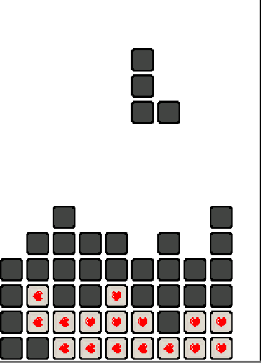
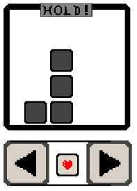
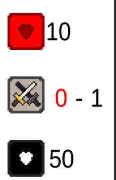

> Note: This Project was never finished and created multiple years ago. Looking back there are multiple things I would prefer to change but I am proud of what I achieved at the time.

# Tetris RPG
Tetris RPG was a project I messed around with years ago when I first messing around with Unity. The goal of the game was to combine Tetris with the ideas from Turned Based Combat to create a style of Tetris that could replace enemy encounters in an RPG. 

With this in mind there were three main modification to the Standard Tetris that I would be adding ontop of creating a Custom Tetris. These being:
- Using Lines scored to damage an Enemy or to Protect against an attack.
- You can change the blocks into specific colors or icons to place those down to use abilities.

### Abilities
Abilities were a form of customization a player could have, allowing for more then simple skill expression from playing Tetris and instead providing some sort of scaling for fights that took place later into the game. 
This would be done by giving the player 4 item slots, each item would provide its own ability. For the use in the following example the following items will be used:
|  Item Name | Ability  |  
| ------------ | ------------ | 
|  Healing Potion | Provides the player health   |   
|  Shield | Block all incoming Attack |
|  Pickaxe | Break any hanging pieces |
|  Bomb | Deal X Damage |

To trigger an ability the player would need to break blocks that have the symbol of that block on it. Once you reach a certain number of blocks that would trigger the ability of the item and then rest the Ability.

The Player can place more blocks by 'painting' the current held block to the ability they want. 

The following code is what handles selection of abilities.  
  
	if(initialPOS == 0) {
		initialPOS = 1;
		if(ability != 0) {
			abilityPOS = PlayField.myabilities[ability - 1];
		} else {
			abilityPOS = 0;
		}
		current = Instantiate(groups[abilityPOS], transform.position, Quaternion.identity);
		FindObjectOfType<holdBlock>().abilitychanged(abilityPOS);
	} else {
		Destroy(current);
		if(ability != 0) {
			abilityPOS = PlayField.myabilities[ability - 1];
		} else {
			abilityPOS = 0;
		}
		Debug.Log(abilityPOS);
		current = Instantiate(groups[abilityPOS], transform.position, Quaternion.identity);
		FindObjectOfType<holdBlock>().abilitychanged(abilityPOS);

  > You can view the full code here: <a href="https://github.com/willpk03/TetrisRPG/blob/main/Assets/Scripts/abilityController.cs">Example #1</a>

### Attacking and being attacked. 
To battle monsters and damage the use of cleared lines was used to deal damage. A certain number of lines or a certain type of clear would give you X amount of damage that would appear on the players screen to the right. 

Then after X amount of time that damage would then attack the enemy. 

At the same time the player had to be underthreat so using the same system the enemy could send attacks your way which would deal damage to you after x amount of time. To block such damage you could clear lines to subtract the incoming attack or use an ability like the Shield. 
Below is the code that was used to display to deal with those timers.

    //Checks if the time has elasped to deal damage
  	FindObjectOfType<Spawner>().enemyattackcheck();
  	if (PlayField.attack.Count > 0) {
  		int num = 0;
  		//Loops through the Current attacks to see which ones have passed waiting 20 seconds
  		while (num <= PlayField.attack.Count - 1) {
  			//Debug.Log(PlayField.attack[num]);
  			if (Time.time - PlayField.lastattack[num] >= 20) {
  				PlayField.enemyHealth = PlayField.enemyHealth - PlayField.attack[num];
  				PlayField.attack.RemoveAt(num);
  				PlayField.lastattack.RemoveAt(num);
  				if(PlayField.enemyHealth <= 0) {
  					Debug.Log("YOU WIN");
  					Destroy(gameObject);
  				}
  			} else {
  				//Debug.Log("Not calculated");
  			}
  			num++;
  		}
  	}
  	//Does the Same Loop for enemy attacks
  	if (PlayField.lastenemyattack.Count > 0) {
  		int num = 0;
  		//Loops through the Current attacks to see which ones have passed waiting 20 seconds
  		while (num <= PlayField.enemyattack.Count - 1) {
  			if (Time.time - PlayField.lastenemyattack[num] >= 20) {
  				PlayField.health = PlayField.health - PlayField.enemyattack[num];
  				PlayField.enemyattack.RemoveAt(num);
  				PlayField.lastenemyattack.RemoveAt(num);
  				Debug.Log("You have: " + PlayField.enemyHealth + "health");
  				if(PlayField.health <= 0) {
  					Debug.Log("Gameover");
  					Destroy(gameObject);
  				}
  			} else {
  				//Debug.Log("Not calculated");
  			}
  			num++;
  		}
  		//Updates text to the side of the screen to be accurate.
  		PlayField.updateText();
  	}

> You can view the full code here: <a href="https://github.com/willpk03/TetrisRPG/blob/main/Assets/Scripts/Group.cs">Example #2</a>
  	
#### How do Enemies Attack
At the current stage of development enemy attacks were setup to attempt to generate each X seconds. When attempting to generate it would randomly pull from a List of ints which were either 0 or 1. If 1 it would then attack if not it would not generate an attack. 
This checking would occur with the function checkEnemyBag and Enemy Bag

> Enemy Bag Function

    public static void enemyBag() {
        int id = Random.Range(0, enemyattackchance.Count);
        //Debug.Log("Running enemybag");
        if (enemyattackchance[id] == 1) {
            //run attack
            //Debug.Log("Attacked");
            if (enemyattackchance.Count == 0) {
                enemyattackchance.RemoveAt(id);
                enemyattackchance.Add(0);
                enemyattackchance.Add(0);
                enemyattackchance.Add(0);
                enemyattackchance.Add(0);
                enemyattackchance.Add(0);
                enemyattackchance.Add(0);
                enemyattackchance.Add(0);
                enemyattackchance.Add(0);
                enemyattackchance.Add(0);
                enemyattackchance.Add(1);
            } else if (enemyattackchance.Count == 1) {
                enemyattackchance.RemoveAt(id);
                enemyattackchance.Add(0);
                enemyattackchance.Add(0);
                enemyattackchance.Add(0);
                enemyattackchance.Add(0);
                enemyattackchance.Add(0);
                enemyattackchance.Add(0);
                enemyattackchance.Add(0);
                enemyattackchance.Add(0);
                enemyattackchance.Add(1);
            } else {
                enemyattackchance.RemoveAt(id);
                enemyattackchance.Add(1);
            }
            enemyattacked(1);
        } else {
            enemyattackchance.RemoveAt(id);
            Debug.Log("attempted attack but missed");
        }
    }

> Check Enemy Bag

    public static void checkenemybag() {
        //Debug.Log("running checkbag");
        if (enemyattackchance.Count > 0) {
            enemyBag();
        } else {
            enemyattackchance.Add(0);
            enemyattackchance.Add(0);
            enemyattackchance.Add(0);
            enemyattackchance.Add(0);
            enemyattackchance.Add(0);
            enemyattackchance.Add(0);
            enemyattackchance.Add(0);
            enemyattackchance.Add(0);
            enemyattackchance.Add(0);
            enemyattackchance.Add(1);
            enemyBag();
        }
    }

> Both functions can be viewed here: <a href="https://github.com/willpk03/TetrisRPG/blob/main/Assets/Scripts/PlayField.cs">Example #3</a>

The Enemy Attacked function will then handle the attacking of the player or checking if it will shield the enemy from an in coming attack. 

    public static void enemyattacked(int attacked) {
        if( attack.Count != 0) {
            int num = 0;
            while (num <= attack.Count -1 && attacked > 0) {
                //Starting by the earliest (0)
                int currentattack = attack[num];
                //Grab the value
                //Check if the attacked value is greater then the enemy attack 
                if (attacked >= currentattack) {
                    //Remove the value at enemyattack(num)
                    attack.RemoveAt(num);
                    //Minise the attacked value by the enemyattack value
                    attacked = attacked - currentattack;
                    //check the next one and repeat.
                } else {
                    //Grab the attacked value and minise the value above if it doesn't equal 0
                    currentattack = currentattack - attacked;
                    attack.RemoveAt(num);
                    attack.Insert(num, currentattack);
                    //set the value at enemyattack to the updated one.
                }
                num++;
            }
    
            if (attacked != 0) {
                enemyattack.Add(attacked);
                lastenemyattack.Add(Time.time);
                attackbefore = 1;
                Debug.Log("EHappening");
                //Debug.Log("Number of Enemy attacks" +  enemyattack.Count);
                //Debug.Log("The enemies health" + enemyHealth);
            }
        }else {
            enemyattack.Add(attacked);
            lastenemyattack.Add(Time.time);
            attackbefore = 1;
            // Debug.Log("Happening");
            // Debug.Log("Number of attacks" +  enemyattack.Count);
            // Debug.Log("The enemies health" + enemyHealth);
        }
        updateText();
    }
